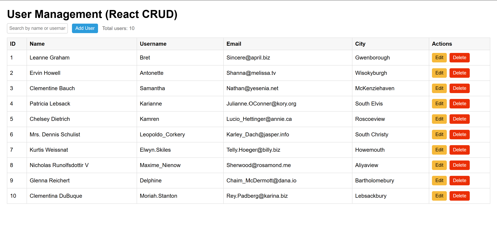
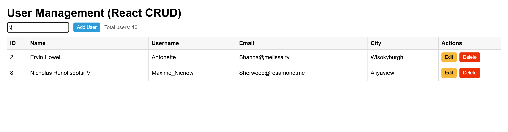
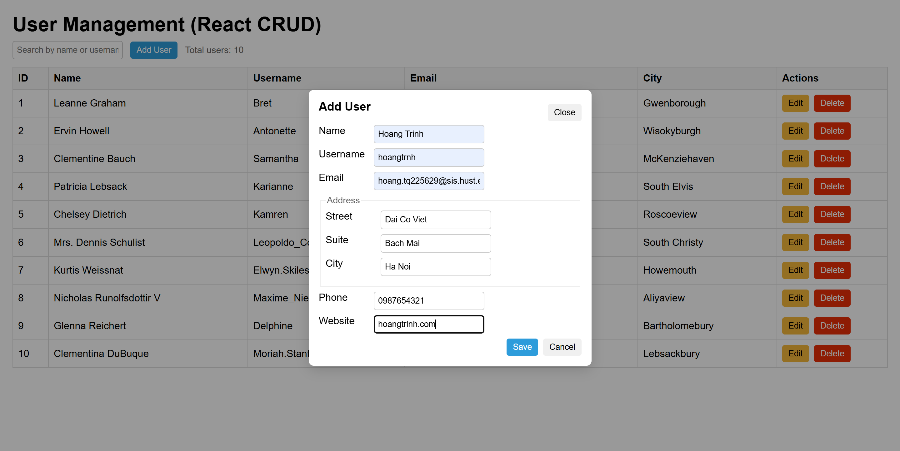
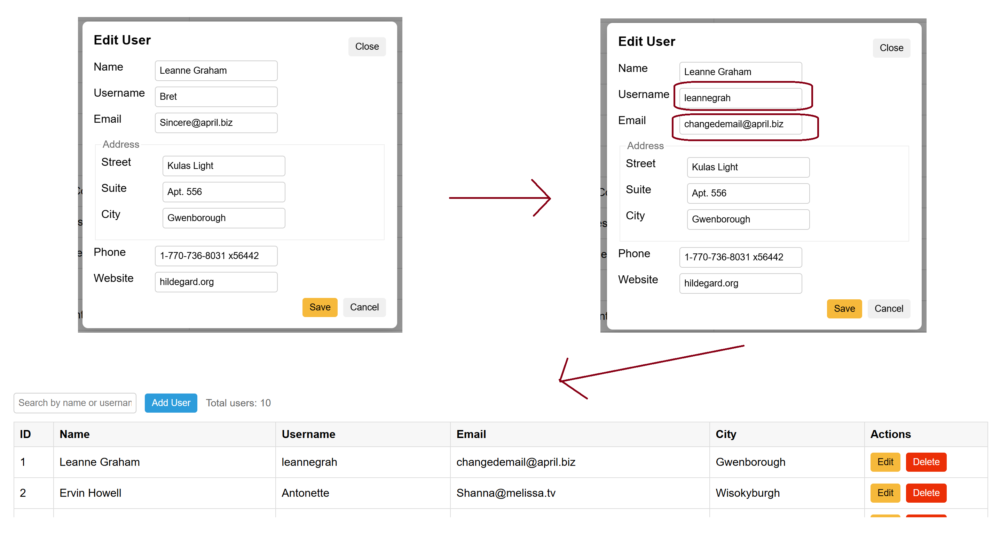
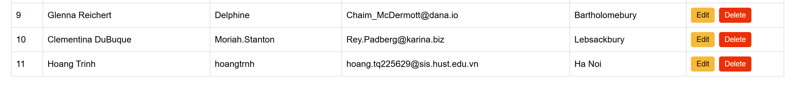
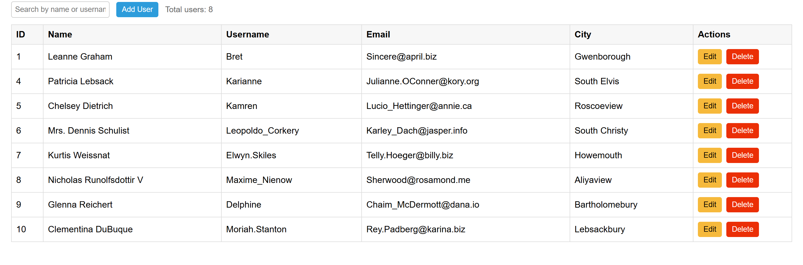

## 1. Overview

The app allows users to:
- Fetch and display user data from `https://jsonplaceholder.typicode.com/users`
- Search users by name or username
- Add new users with validation
- Edit existing users (in a modal form)
- Delete users without confirmation

All operations are performed in the browser (no backend database).

---

## 2. Demo Screenshots

### 2.1. App Interface

### 2.2. Search Function

### 2.3. Add User Modal

### 2.4. Edit User Modal

### 2.5. User List after Adding a New User

### 2.6. User List after Deleting a User

---

## 3. How to Run

1. Download or clone this repository.
2. Open `index.html` in any modern browser (Chrome, Edge, Firefox).
3. The app will automatically load users from the API and display them in the table.

